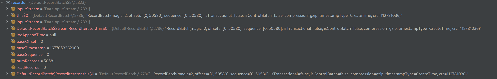

# Play with batching in Kafka

This demo shows how to use batching in Kafka. It is a simple producer and consumer that sends and receives messages in batches.

We also demonstrate compression which is done on a per batch base.


Producer properties

```java
        props.put("compression.type", "gzip");
        props.put("batch.size", 1638400);
        props.put("linger.ms", 5000);

```

* compression.type: gzip ensures that many messages get into the batch
* batch.size: 1638400 is the maximum size of the batch in bytes
* linger.ms: 5000 is the maximum time to wait for more messages to arrive before sending the batch

With this some 10k messages should go into a batch.


On consumer side observe how many records you get in one poll with the following property:

```java
        props.put("max.poll.records", 500);
```

You will notice that you get only 500 records in one poll. But looking into 
`org.apache.kafka.clients.consumer.internals.Fetcher.CompletedFetch.fetchRecords` and
`org.apache.kafka.clients.consumer.internals.Fetcher.CompletedFetch.nextFetchedRecord`
you can see that the batch returned from the broker is actually split into chunks of 500 records.



You see the RecordBatch with an offset range from 0  to 50580 records that are returned from the fetch request.

On the RecordBatch you see the `compression=gzip` which means that the whole batch was compressed with gzip.
See also https://kafka.apache.org/11/documentation.html#recordbatch.

## How to run

* Start kafka
* Create topic
* Set the topic name in producer and consumer
* Run the producer
* Run the consumer
* Observe the output
* Eventually set some breakpoints in the code to see what happens
* Experiment with different batch sizes and compression types and the other settings


## How could we change the Kafka client properties on the fly?

We cannot change the properties once the KafkaProducer or KafkaConsumer is created.
If we need to change it we could stop the producer or consumer and create a new one with the new properties.
This is demonstrated in `ProducerChangeProperties` class.

**WARNING**: Be aware that a change in the Consumer properties will trigger a rebalance with may lead to a change back of properties on other consumers.
Such things can cause rebalance loops and cause a lot of trouble.
