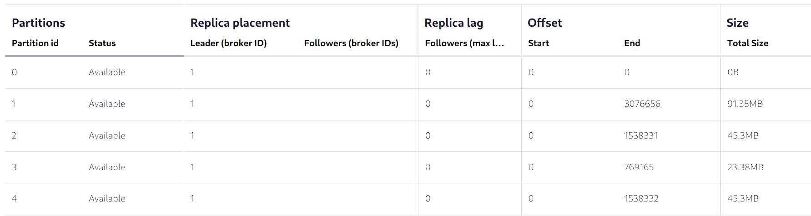

# Why did we end up with this unbalanced topic?

Look at the end offsets of the partitions:



How can this happen?

**Seems that the key space is not very big. We have 13 keys and 6 partitions.**

See more in the `KeyspaceDemo.java`. 

You can experiment with other Serializers or different key spaces. The demo prints out the derived partition for each key
and gives a summary on how many keys go to each partition.

Example output:

```bash

key: stream-9 goes to partition 5
key: stream-10 goes to partition 5
key: stream-11 goes to partition 3
key: stream-12 goes to partition 1
key: stream-0 goes to partition 5
key: stream-1 goes to partition 4
key: stream-2 goes to partition 2
key: stream-3 goes to partition 1
key: stream-4 goes to partition 4
key: stream-5 goes to partition 1
key: stream-6 goes to partition 1
key: stream-7 goes to partition 5
key: stream-8 goes to partition 2


Keyspace 13
Keys per Partition: 
Partition 0: null
Partition 1: 31
Partition 2: 16
Partition 3: 7
Partition 4: 16
Partition 5: 30
   
```